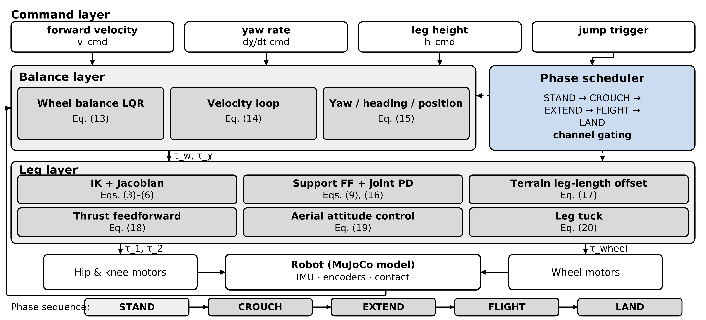

# 第 3 章初稿：统一运动控制框架

> 中文初稿，公式用 LaTeX 写，表 2 与图题为英文可直接进模板。
> 公式编号承接第 2 章：**(13)~(20)**，共 8 个；图 3；表 2。
> 篇幅目标：英文约 1750 词，排版约 2.1 页。
> 所有增益与限幅均取自 `src/controllers/default_params.py`，已逐个核对（见文末）。

---

## 3.1 总体架构与相位调度

本文的控制框架由命令层、平衡层与腿层三部分构成，如图 3 所示。命令层接收前进速度、转向角速度、
目标腿高与跳跃触发四类指令；平衡层通过 LQR 统一处理机体的俯仰平衡、速度跟踪与航向保持；
腿层负责各腿关节的力矩输出，包括腿高跟踪、地形自适应、蹬伸推力与腾空姿态。

为在同一组控制参数下覆盖多种运动模态，本文采用**相位独占**的调度方式：整机状态由相位机统一管理
（STAND / CROUCH / EXTEND / FLIGHT / LAND / FALLEN），每个相位下只允许一类任务占用腿电机与
轮电机的力矩预算。

- **STAND**：平衡层全通道工作（平衡、速度、位置、航向），腿层跟踪腿高指令并按地形调整左右腿高差。
  平地行驶、原地转向、变高度与地形跟随等模态都在该相位下完成。
- **CROUCH / EXTEND / LAND**：腿部交由跳跃轨迹接管，平衡层降级为"仅保轮子"——目标俯仰角只保留
  当前几何下的平衡角，航向积分冻结，避免起跳与落地期间打滑产生的单边误差被积分放大。
- **FLIGHT**：轮力矩置零，腿层切换为腾空姿态控制与收腿。
- **FALLEN**：输出全部置零。

表 2 汇总了各模态下的通道分配与参数复用情况。可以看出，**模态之间的切换只改变参考量与输出限幅，
控制器结构与基础参数保持不变**；仅在跳跃的某些相位内对腿层增益做比例缩放（原因见 3.4 节），
不需要为每个模态重新整定控制器。

> **图 3** 图题（英文）：*Fig. 3. Architecture of the unified control framework with phase-based
> scheduling.* （三层结构 + 右侧相位时间轴，标注各相位下启用的通道）

---

## 3.2 平衡与运动控制

机体平衡由轮式倒立摆回路完成。取俯仰角误差与俯仰角速率作为状态，前向轮力矩为

$$\tau_w=-K\begin{bmatrix}\phi-\phi_{\mathrm{ref}}\\ \dot\phi\end{bmatrix},
\qquad K=[-45.0,\ -7.0] \tag{13}$$

其中 $K$ 由实机单步响应标定得到（见 2.3.5 节）。$\phi_{\mathrm{ref}}$ 为目标俯仰角，
由平衡角与速度外环共同给出：

$$\phi_{\mathrm{ref}}=\phi_{\mathrm{eq}}
+\mathrm{clip}\!\left(K_{pv}e_v+K_{iv}\!\int e_v\,dt,\ \pm 0.2\ \mathrm{rad}\right),
\qquad e_v=v_{\mathrm{cmd}}-v \tag{14}$$

其中 $e_v$ 为速度误差，$K_{pv}=0.35$，$K_{iv}=0.3$；积分项带门控，仅在机器人处于驱动状态且目标
俯仰未饱和时累积，避免停车瞬间的积分残留引起轮力矩跳变；$\phi_{\mathrm{eq}}$ 为当前腿高下由整机
质心位置确定的平衡俯仰角，随腿高变化实时重算。

当机器人不接收速度指令时，位置外环把机体缓慢拉回出发点：以位置误差生成速度修正量
（比例增益 3.0、阻尼增益 3.5），并限制在 0.6 m/s 以内。航向通道由阻尼项与积分项组成，
在无转向指令时由航向保持外环以不超过 0.8 rad/s 的速率把偏航角拉回锚定值：

$$\tau_\chi=-\mathrm{clip}\!\left(K_{d\chi}\dot\chi_{\mathrm{err}}
+K_{i\chi}\!\int\dot\chi_{\mathrm{err}}\,dt,\ \pm 2.0\ \mathrm{N\cdot m}\right) \tag{15}$$

其中 $K_{d\chi}=8.0$、$K_{i\chi}=6.0$。输出限幅 ±2.0 N·m 的依据是：正常行驶转向仅需约 0.8 N·m，
而机体受外力偏航时若不加限制，航向通道会占满轮电机的力矩预算，挤压平衡通道的可用余量。

由于左右驱动轮的关节轴方向相反，同一前进力矩在两轮上的执行器指令取异号、同一转向力矩取同号，
即 $\tau_L=+\tau_w-\tau_\chi$、$\tau_R=-\tau_w-\tau_\chi$。

此外，指令层对速度与转向指令做斜坡限速（线加速度 ≤ 2.5 m/s²、转向角加速度 ≤ 1.0 rad/s²），
并对高站姿做联动保护：当腿高超过 0.45 m 时，线速度与转向指令分别限制在 0.3 m/s 与 0.2 rad/s，
避免高位状态下抗扰余量不足。

---

## 3.3 腿部控制：支撑前馈与地形自适应腿长

腿层在关节空间完成跟踪。对每个腿关节（$j=1,2$ 分别对应髋、膝关节），输出力矩由支撑前馈与
关节 PD 组成：

$$\tau_j=\tau_{\mathrm{ff},j}+k_p(\theta_{\mathrm{ref},j}-\theta_j)
+k_d(\dot\theta_{\mathrm{ref},j}-\dot\theta_j) \tag{16}$$

其中 $\theta_{\mathrm{ref},j}$ 由 2.2 节逆运动学从目标腿高解出，$k_p=200$、$k_d=60$；
$\dot\theta_{\mathrm{ref},j}$ 为目标腿高变化率经雅可比换算得到的**目标关节角速度前馈**。
支撑前馈 $\tau_{\mathrm{ff},j}$ 采用第 2 章式 (9) 的解析式，其第一项对应整车重量经轮子传导的
载荷路径，第二项为腿连杆自重。

**地形自适应腿长**（对应单腿变高度越障模态）：当一侧轮子骑上台阶或坡面时，两轮轮心高度不再相同。
为使机体保持水平，左右腿的目标腿高需要取不同的值：

$$\Delta h_L=-\tfrac{1}{2}\left(z_L-z_R\right)+k_\psi\psi+k_{d\psi}\dot\psi,
\qquad \Delta h_R=-\Delta h_L,\qquad \left|\Delta h_L\right|\le 0.035\ \mathrm{m} \tag{17}$$

其中 $z_L,z_R$ 为左右轮心高度，$\psi$ 为机体侧倾角；该侧腿的目标腿高为 $h_{\mathrm{ref}}=h_{\mathrm{cmd}}+\Delta h$。
式 (17) 由地形几何直接给出，属于前馈；侧倾反馈项默认置零（$k_\psi=0$），因为实测反馈项会引入振荡。
偏置限幅 ±0.035 m 用于给腿长的可用区间留出余量。

需要特别说明的是，仅靠式 (17) 的腿高偏置并不足以保证机体水平：**真正决定地形通过性的，是
目标关节角速度前馈 $\dot\theta_{\mathrm{ref}}$ 是否有效**。若腿只按位置误差跟踪一个持续变化的
腿高目标，腿总是滞后于地形；而机身侧倾近似等于（左右轮高差 + 左右腿指令高差）与轮距之比，
因此腿的滞后会直接表现为机体不水平。引入 $\dot\theta_{\mathrm{ref}}$ 后，腿主动追随移动中的
地形目标，同一工况（65 mm 单轮坡、0.3 m/s）的侧倾峰峰值由 9.31° 降至 0.30°。

该前馈在早期实现中曾被关闭，原因是当时的支撑前馈由仿真器逆动力学给出：该前馈在转向工况下
残差高达 133.6 rad/s²（甚至大于不施加前馈时的 36.7 rad/s²），其错误值经 $k_d\dot\theta_{\mathrm{ref}}$
放大后使腿电机力矩持续饱和，表现为过坡时翻车。改用式 (9) 的解析前馈后，前馈量只依赖刚体几何，
$\dot\theta_{\mathrm{ref}}$ 得以恢复并使地形通过性显著改善。

---

## 3.4 跳跃轨迹与推力前馈

跳跃过程按相位划分为 CROUCH（下蹲蓄力，0.08 s，下蹲深度 0.03 m）、EXTEND（蹬伸）、
FLIGHT（腾空）、LAND（落地缓冲，0.15 s）。CROUCH 与 LAND 用五次多项式连接位移、速度与加速度
边界，EXTEND 采用恒加速度轨迹，其时长由伸腿行程 $\Delta h_s$ 与离地速度反推
$T_{\mathrm{ext}}=2\Delta h_s/v_{\mathrm{to}}$，其中 $v_{\mathrm{to}}$ 由期望跳跃高度按第 2 章式 (11) 给出。

把第 2 章式 (9) 中的重力加速度替换为 $g+\ddot h_{\mathrm{ref}}$，即得蹬伸所需的关节力矩前馈：

$$\tau_j^{\mathrm{thrust}}=J_j\cdot\frac{m\left(g+\ddot h_{\mathrm{ref}}\right)}{N}
+\sum_{i\in\text{leg}}m_i\left(g+\ddot h_{\mathrm{ref}}\right)\frac{\partial z_i}{\partial\theta_j} \tag{18}$$

其中 $\ddot h_{\mathrm{ref}}$ 为轨迹给出的期望腿高加速度。该前馈项**不按接触状态门控**：
蹬伸末段机器人即将离地，正是最需要推力的时候。

由于 CROUCH/EXTEND 期间的腿高变化率远大于平地工况，关节 PD 的微分项会与"关节—地面接触"形成的
刚度回路构成两步极限环（实测把微分增益放大到 1.5 倍后，四条腿电机力矩全程饱和、弹道反而下降）。
因此跳跃相位内对腿层增益按相位缩放：$k_p\times1.5$、$k_d\times0.15$，
这正是表 2 中"仅相位内增益缩放"的含义。

落地缓冲采用独立的 PD 增益（$k_p=80$、$k_d=8$，对应缓冲模态阻尼比约 0.65），并在该相位取消
STAND 相位的腿力矩软限幅，直接使用执行器上限，以保证触地瞬间的冲击吸收不被限幅截断。

跳跃触发需要满足四个条件：站立稳定时间 ≥ 1.2 s、两轮均接地、$|\phi|<0.2\ \mathrm{rad}$、
各角速率与轮地打滑量在限值以内；不满足时丢弃本次指令，避免在残余振荡中起跳导致偏航发散。

此外，**着地相位时长直接影响落地冲击的姿态响应**：CROUCH/EXTEND 期间整机质心相对轮轴逐渐后移，
相位越长，落地瞬间质心偏离轮轴的距离越大，落地冲击经该力臂注入的后仰角冲量也越大；
平衡回路只能通过降低前进速度把俯仰拉回，表现为跳跃后"刹停再加速"。把下蹲时长由 0.25 s 缩短到
0.08 s 后（其余参数不变），2.5 m/s 行驶中跳跃的 2 s 行程保持率由 21.5% 提升到 85.0%，
落地最低速由 0 m/s（刹停）恢复到 +1.46 m/s，落地俯仰峰值由 64.1°（随后失稳）降到 21.9°。

---

## 3.5 腾空姿态控制与收腿

腾空段机器人无法获得外力矩，只能通过关节力矩重新分配角动量来调节姿态。由第 2 章式 (10)，
左右髋关节轴镜像布置时，两侧同号关节力矩在机体坐标系中相互抵消，只有差分驱动才能产生姿态力矩。
据此，腾空姿态控制取

$$\tau_{\mathrm R}=+\tau_{\mathrm{att}},\qquad \tau_{\mathrm L}=-\tau_{\mathrm{att}},\qquad
\tau_{\mathrm{att}}=\mathrm{clip}\!\left(-K_{\mathrm{fl}}\dot\phi,\ \pm 6.0\ \mathrm{N\cdot m}\right) \tag{19}$$

其中 $K_{\mathrm{fl}}=1.5\ \mathrm{N\cdot m\cdot s/rad}$。式 (19) 只包含俯仰角速率的阻尼项，
不含姿态角的位置反馈项：腾空期间腿部重力摆动与蹬伸末段的角动量回馈会给机体一个约
$+2.3\ \mathrm{N\cdot m}$ 的恒定偏置力矩，若引入位置项会与该偏置形成正反馈，
实测俯仰发散至 $\pm 0.6\ \mathrm{rad}$。

**腾空收腿**：越障净空等于质心弹道高度与收腿量之和。由第 2 章式 (11)，质心弹道受膝关节电机
峰值力矩限制（弹道 133 mm 时膝力矩已达峰值的 97%），而收腿量不受此限制，
因此收腿成为提升越障净空的直接手段。收腿时序按归一化滞空时间 $\tau=t/t_f$ 分段：

$$h_{\mathrm{ref}}(\tau)=
\begin{cases}
h_{\mathrm{high}}, & \tau<0.15\\
h_{\mathrm{high}}-\left(h_{\mathrm{high}}-h_{\mathrm{tuck}}\right)S\!\left(\frac{\tau-0.15}{0.30}\right),
 & 0.15\le\tau<0.45\\
h_{\mathrm{tuck}}, & 0.45\le\tau<0.62\\
h_{\mathrm{tuck}}+\left(h_{\mathrm{high}}-h_{\mathrm{tuck}}\right)S\!\left(\frac{\tau-0.62}{0.30}\right),
 & 0.62\le\tau<0.92\\
h_{\mathrm{high}}, & \tau\ge 0.92
\end{cases} \tag{20}$$

其中 $S(x)=x^2(3-2x)$ 为平滑过渡函数，$h_{\mathrm{high}}$ 为蹬伸末端的腿高，
$h_{\mathrm{tuck}}=0.35\ \mathrm{m}$ 为收腿目标腿高，$t_f$ 为预估滞空时间。
收腿与展腿由对称的关节 PD 驱动，其微分项需带目标角速度前馈，否则阻尼项会对抗收腿运动本身，
使实际收腿量损失约一半。落地前收腿完成，LAND 相位从实际触地腿高接管。
当预估滞空时间小于 0.25 s（小幅跳跃）时，收放时序无法完成，此时退回"入腾空瞬间锁存膝角"
的保持策略。

---

## 表 2（可直接进模板，也是"统一性"的核心证据）

**Table 2. Channel allocation and parameter reuse across locomotion modes.**

| Mode (phase) | Balance channel | Leg channel | Controller parameters |
|---|---|---|---|
| STAND: driving, turning, height regulation, terrain following | Full LQR: balance + velocity + position + heading hold | Leg-height tracking + terrain-adaptive leg-length offset, Eq. (17) | Unchanged |
| CROUCH / EXTEND | Wheel balance + yaw correction only; yaw integral frozen | Jump trajectory tracking + thrust feedforward, Eq. (18) | Leg gains scaled in-phase: $k_p\times1.5$, $k_d\times0.15$ |
| FLIGHT | Wheel torque set to zero | Mirrored-hip differential attitude control, Eq. (19) + leg tuck, Eq. (20) | Attitude gain $K_{\mathrm{fl}}$ engaged |
| LAND | Wheel balance + yaw correction only | Trajectory tracking with landing gains | $k_p=80$, $k_d=8$; soft leg-torque limit removed |
| FALLEN | Zero output | Zero output | — |

> 排版提示：这张表比一般表格宽，建议做成单栏、字号略小；若做成双栏表会占掉约 0.2 页。

---

## 参数速查（写正文与答疑时用，不必全部进论文）

| 参数 | 取值 | 出现位置 |
|---|---|---|
| 平衡增益 $K$ | $[-45.0,\ -7.0]$ | 式 (13) |
| 速度环 $K_{pv}$ / $K_{iv}$ | 0.35 / 0.3（倾角限幅 ±0.2 rad） | 式 (14) |
| 位置外环 $k_p$ / $k_d$ / 速度限幅 | 3.0 / 3.5 / 0.6 m/s | 3.2 节 |
| 航向 $K_{d\chi}$ / $K_{i\chi}$ / 限幅 | 8.0 / 6.0 / ±2.0 N·m | 式 (15) |
| 航向保持外环 $k_p$ / 回正速率上限 | 2.0 / 0.8 rad/s | 式 (15) 说明 |
| 轮力矩限幅 | ±9 N·m | 式 (13) 说明 |
| 指令斜坡 | 线 2.5 m/s²、转向 1.0 rad/s² | 3.2 节末 |
| 高位保护 | >0.45 m 时 0.3 m/s / 0.2 rad/s | 3.2 节末 |
| 腿层 PD $k_p$ / $k_d$ | 200 / 60 | 式 (16) |
| STAND 腿力矩软限幅 | 30 N·m | 3.3 节 |
| 地形腿高差限幅 | ±0.035 m | 式 (17) |
| 跳跃相位增益缩放 | $k_p\times1.5$、$k_d\times0.15$ | 3.4 节 |
| 落地增益 $k_p$ / $k_d$ | 80 / 8 | 3.4 节 |
| 着陆腿力矩限幅 | 60 N·m（= 执行器上限，不再软限幅） | 3.4 节 |
| 跳跃相位时长 | CROUCH 0.08 s、LAND 0.15 s | 3.4 节 |
| 腾空姿态增益 $K_{\mathrm{fl}}$ / 限幅 | 1.5 / ±6.0 N·m | 式 (19) |
| 收腿参数 | $h_{\mathrm{tuck}}=0.35$ m、$k_p=200$、$k_d=8$ | 式 (20) |
| 跳跃触发门槛 | 静稳 ≥1.2 s、双轮接地、$\lvert\phi\rvert<0.2$ rad、打滑量限值 | 3.4 节 |

---

## 公式一览（承接第 2 章 (1)~(12)）

| 式号 | 内容 | 位置 | 依据 |
|---|---|---|---|
| (13) | 平衡回路 $\tau_w=-K[\phi-\phi_{\mathrm{ref}},\dot\phi]^{\mathsf T}$ | 3.2 | 实测标定 |
| (14) | 速度外环 → 目标俯仰 | 3.2 | 分层控制通用结构 |
| (15) | 航向/转向通道 | 3.2 | — |
| (16) | 关节空间跟踪 + 目标角速度前馈 | 3.3 | 依赖第 2 章式 (6) 雅可比 |
| (17) | 地形自适应腿高差 | 3.3 | **本机新增**，对应贡献（1）中的单腿变高度模态 |
| (18) | 蹬伸推力前馈 | 3.4 | 由第 2 章式 (9) 扩展得到 |
| (19) | 镜像髋差分姿态律 | 3.5 | 由第 2 章式 (10) 导出，对应贡献（3） |
| (20) | 腾空收腿时序 | 3.5 | 对应贡献（4）中的"净空"一项 |

第 3 章共 8 个公式，全文累计 20 个（与 `00_full_outline.md` 的预算一致）。

---

## 与第 4 章的接口（结果章要用到的每个数字）

| 第 3 章的结论 | 第 4 章验证用的场景 | 期望结果 |
|---|---|---|
| 式 (13)(14) 平衡与速度跟踪 | `stand_12s`、`speed_0p8/1p5/2p0/2p5` | 俯仰 ≤2.7°、跟踪 rms 0.015 m/s |
| 式 (15) 转向通道 | `turn_0p5` | 指令 0.5 rad/s → 实测 0.500 rad/s |
| 式 (16) 关节跟踪 + 角速度前馈 | `ff_ramp65_scale0p0/0p8/1p0` | 侧倾峰峰 8.38° → 0.44° → 0.07° |
| 式 (17) 地形自适应腿长 | `ramp_*`、`pad_static_10mm`、`wavy_*` | 65 mm 坡侧倾 ≤0.1°；波浪路 1.0 m/s 通过 |
| 式 (18) 推力前馈 | `jump_amp_0p40~1p00` | 弹道 43.9 → 133.2 mm、蹬伸膝力矩峰 42.0 → 58.2 N·m（70% → 97%） |
| 式 (19) 镜像髋差分驱动 | `jump_attitude_samesign` vs `jump_attitude_diff` | 飞行俯仰 36.0° → 11.4° |
| 式 (20) 收腿 | `jump_tuck_on` vs `jump_tuck_off` | 净空 213 mm vs 114 mm（力矩相同） |
| 3.4 节着地相位时长 | `jump_run_2p5` / `jump_run_2p5_crouch0p25` | 行程保持率 85.0%（仅 CROUCH 0.25 s 时为 21.5%） |

命令：`cd robot_sim && .venv/bin/python -m paper.run_cases --all`（约 2 分钟，输出 `paper/data/*.json`）。

---

## 写作时要注意的三点

1. **"统一"必须有可检验的表述**。本文的说法是"模态切换只改变参考量与输出限幅；控制器结构与基础参数
   不变；跳跃相位内仅做增益比例缩放"。**不要写成"所有模态参数完全相同"**——那与表 2 的第 3~4 行
   自相矛盾，审稿人一查就发现。
2. **式 (17) 要写清"是前馈"**。它由两轮轮心高度差直接算出，不含姿态反馈（$k_\psi=0$），
   否则读者会以为侧倾是闭环调出来的，而实测反馈项反而引起振荡。
3. **3.3 节末那段"为什么以前关掉"不要删**。它是贡献（2）与贡献（1）之间的因果连接
   ——没有解析前馈，就没有有效的角速度前馈，也就没有地形通过性。删掉之后，
   第 4 章"侧倾 9.31°→0.30°"会显得像是调参调出来的。

---

## 待确认（写进论文前跑一次）

1. **3.4 节的"下蹲 0.25 → 0.08 s，行程保持率 21.5% → 85.0%"**：由场景注册表的两个场景
   `jump_run_2p5` 与 `jump_run_2p5_crouch0p25` 给出，`.venv/bin/python -m paper.run_cases
   --group jump` 一条命令复现。该对照严格单变量：`jump_overrides` 里只改 `crouch_duration`，
   蹲深、伸腿行程、速度曲线与其余参数完全相同。
   （旧的 `test_jump_moving.py --baseline` 输出同时改了下蹲时长、蹲深与伸腿行程，文件已删除。）
2. **3.3 节的"9.31° → 0.30°"**：`ff_ramp65_scale0p0` 与 `ff_ramp65_scale1p0` 两个场景可直接复现
   （本机新的场景时序下为 8.38° → 0.07°；两组数字口径不同，论文里只用一组，建议用新的）。
3. **式 (19) 中"约 +2.3 N·m 的恒定偏置力矩"**：来自项目归档的分析，如需写进论文建议用
   `jump_amp_1p00` 的力矩数据再核一遍，或改写成定性表述（"存在一个由腿部运动引起的恒定偏置力矩"）。
